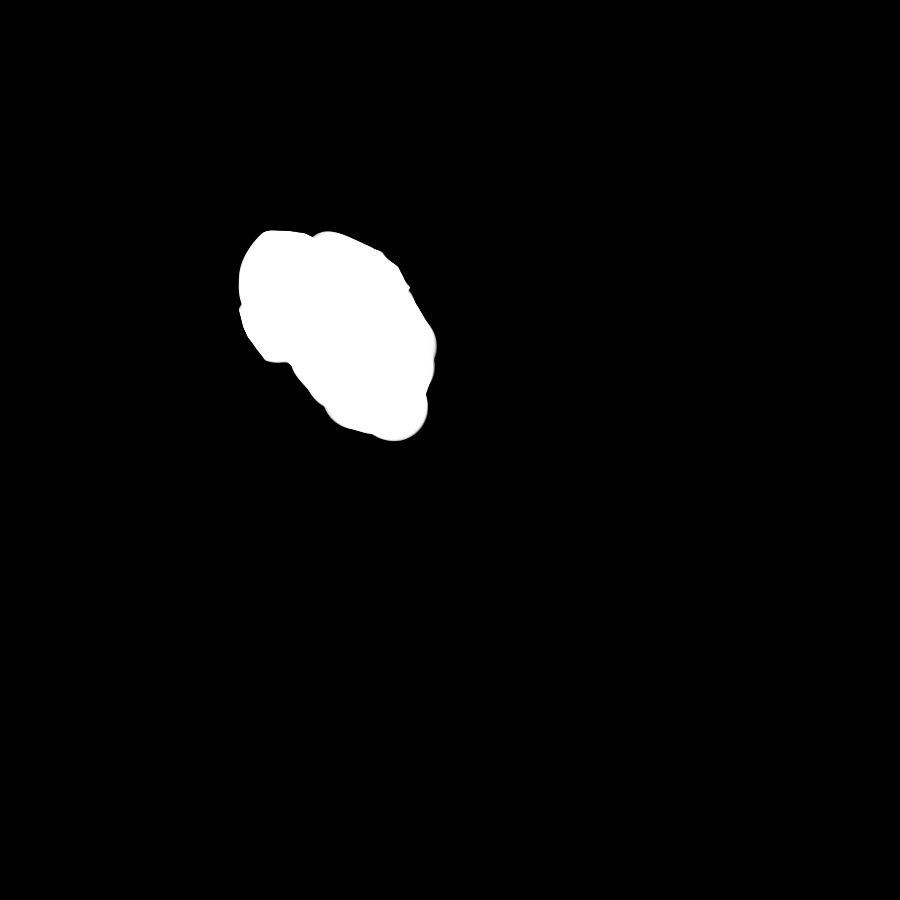
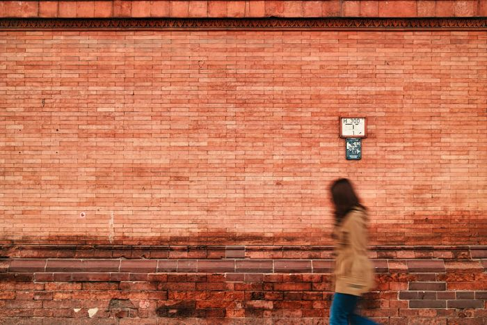
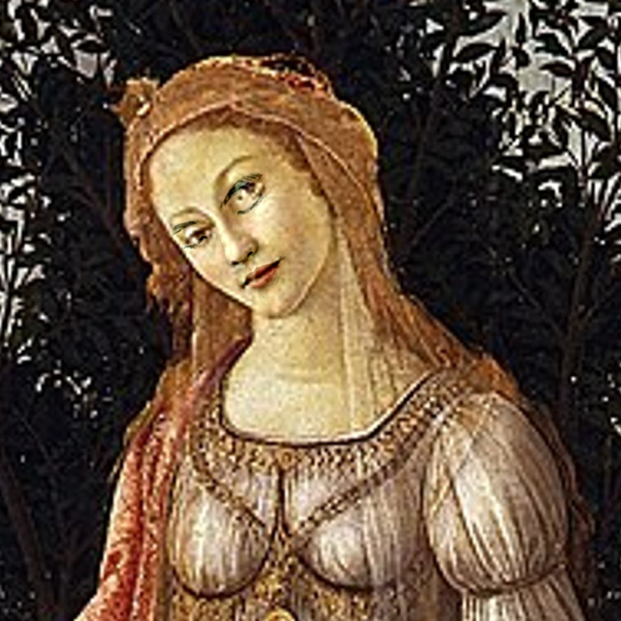

<!-- Mathjax Support -->

# Gradient Domain Fusion

[//]: # (![mixed gradients blended mural]&#40;assets/out_vase_mural2_mix.png&#41;)

1. Table of Contents
{:toc}

This project explores gradient-domain processing, a technique that can be applied in blending, tone-mapping and non-photorealistic rendering. Our primary focus is Poisson blending which also serves as the foundation for blending with mixed gradients. 

In order to blend multiple images seamlessly, we previously used Gaussian and Laplacian stacks to implement multiresolutional blending. However, this still resulted in noticeable seams at times. To resolve this issue, we recognize that the human eye is more sensitive to the gradient of an image than the overall intensity. Thus, we assign pixel values to maximally preserve the gradient of the source region without changing any of the background pixels in the target image. As a side effect, because we disregard the overall intensity, this method may change colors of objects in the source region which may or may not be desired. 

## Toy Problem
To familiarize ourselves with gradient domain operations, we reconstruct an image from gradients. Given a source image $$s$$, our goal is to construct the identical $$v$$ with the same gradients. Therefore, this can be formulated as an optimization problem with each pixel $$v(x, y)$$ having two objectives:

1. $$\min_v ( v(x+1,y)-v(x,y) - (s(x+1,y)-s(x,y)) )^2$$ to closely match the $$x$$-gradients of $$v$$ to those in $$s$$
2. $$\min_v ( v(x,y+1)-v(x,y) - (s(x,y+1)-s(x,y)) )^2$$ to closely match the $$y$$-gradients of $$v$$ to those in $$s$$

Because these objectives can be solved while adding a constant value to $$v$$, we add an another objective:

$$\min_v (v(0,0)-s(0,0))^2$$ to ensure that the top left corners of $$v$$ and $$s$$ are the same color.

We then convert this to a least squares problem $$v = \arg\min_v \lVert A \vec{v} - \vec{b} \rVert ^2$$ by constructing $$A$$ and $$\vec{b}$$ as follows: 

$$\begin{aligned} A(e, \text{im_to_var}(y, x + 1)) &= 1 \\ A(e, \text{im_to_var}(y, x)) &= -1 \\ b(e) &= s(y, x + 1) - s(y, x)\end{aligned}$$

and

$$\begin{aligned} A(e, \text{im_to_var}(y + 1, x)) &= 1 \\ A(e, \text{im_to_var}(y, x)) &= -1 \\ b(e) &= s(y + 1, x) - s(y, x)\end{aligned}$$

- $$e =$$ index of each equation
- $$\text{im_to_var}(y, x) = $$ array that maps each $$(y, x)$$ coordinate to its flattened 1D value

| Source image $$s$$                      | Reconstructed image $$v$$             |
|:----------------------------------------|:--------------------------------------|
|  |  |

## Poisson Blending

We adapt our image reconstruction process to implement Poisson blending. Given a target image $$t$$ and source image $$s$$, pixels are selected from a source region $$S$$ in $$s$$ and seamlessly incorporated with the pixels in $$t$$ to create the new image $$v$$. These values are combined and blended together by solving the following optimization problem:

$$\min_v \sum_{i \in S, j \in N_i \cap S} (v_i - v_j - (s_i - s_j))^2 + \sum_{i \in S, j \in N_i \cap \bar{S}} (v_i -
t_j - (s_i - s_j))^2$$
- $$s = $$ source image
- $$t = $$ target image
- $$v = $$ new blended image
- $$S = $$ source region
- $$\bar{S} = $$ area outside $$S$$
- $$i = $$ coordinate in $$S$$
- $$j = $$ 4-neighbor of $$i$$ (top, bottom, left, right) which is calculated by adding $$(dy, dx)$$ to $$i = (x, y)$$

First, $$s$$ is created by taking an image and transforming it so that the scene component to be integrated into $$t$$ is aligned and scaled to the correct size. In addition, we applied a binary mask to define the boundaries of $$S$$. This was all done using the software Krita. 

| Original source image $$s$$         | Target image $$t$$                    | Transformed $$s$$                             | Mask                               |
|:------------------------------------|:--------------------------------------|:----------------------------------------------|:-----------------------------------|
|  |  |  |  |

As with the toy problem, the objective function is formulated as a least squares problem to solve for $$v = \arg\min_v \lVert A \vec{v} - \vec{b} \rVert ^2$$.

Each value of $$v_i$$ is computed depending on whether the neighbor of $$s_i$$ is in $$S$$ or $$\bar{S}$$ by creating $$A$$ and $$\vec{b}$$ as follows:

If $$s_j \in S$$:

$$\begin{aligned} A(e, \text{im_to_var}(y, x)) &= 1 \\ A(e, \text{im_to_var}(y + dy, x + dx)) &= -1 \\ b(e) &= s(y, x) - s(y + dy, x + dx)\end{aligned}$$

If $$s_j \in \bar{S}$$:

$$\begin{aligned} A(e, \text{im_to_var}(y, x)) &= 1 \\ b(e) &= t(y + dy, x + dx) + s(y, x) - s(y + dy, x + dx)\end{aligned}$$

Hikers & Penguin

| penguin                             | hikers                                | mask                                        | Poisson blended image $$v$$                       |
|:------------------------------------|:--------------------------------------|:--------------------------------------------|:--------------------------------------------------|
|  |  |  |  |

Botticelli's _Primavera_ & Elana's self-portrait

| Botticelli's _Primavera_                    | Elana's self-portrait                             | mask                                         | Poisson blended image $$v$$                  |
|:--------------------------------------------|:--------------------------------------------------|:---------------------------------------------|:---------------------------------------------|
|  |  |  |  |

Sharks & Swimmer

| sharks                             | swimming child                            | mask                                            | Poisson blended image $$v$$                       |
|:-----------------------------------|:------------------------------------------|:------------------------------------------------|:--------------------------------------------------|
|  |  |  |  |

Lunazilla

| Luna                                   | city                             | mask                                          | Poisson blended image $$v$$                         |
|:---------------------------------------|:---------------------------------|:----------------------------------------------|:----------------------------------------------------|
|  |  |  |  |

 Mural

| _Se pousser (To push oneself)_   | brick wall                         | mask                                   | Poisson blended image $$v$$                   |
|:---------------------------------|:-----------------------------------|:---------------------------------------|:----------------------------------------------|
|  |  |  |  |

### Comparison with Laplacian blending

Botticelli's _Primavera_ & Elana's self-portrait

| Poisson blended image                        | Laplacian blended image                                                  |
|:---------------------------------------------|:-------------------------------------------------------------------------|
|  |  |

In this case, it is advantageous to use Poisson blending over Laplacian blending to match the overall color palette of the blended component to the background. On the other hand with Laplacian blending, the preservation of pixel intensities results in a rough graft onto the target image. 

Lunazilla

| Poisson blended image                               | Laplacian blended image                              |
|:----------------------------------------------------|:-----------------------------------------------------|
|  |  |

Laplacian blending has its merits in avoiding unwanted color changes. Here, using Poisson blending caused an odd green stain on Luna, while this did not occur with Laplacian blending. In this case in particular, the rough boundaries around Luna in addition to the bright flash in the original image contribute to the charm of the blended result. Stylistically, the image of giant cat in the city is not meant to look smooth and natural. Laplacian blending achieves a roughly cut-and-pasted effect that enhances the chaos wreaked in the city by a gamboling Lunazilla.     

## Bells & Whistles

### Mixed Gradients

Building off of Poisson blending, we implement mixed gradient blending. This involves the same general process but instead of always using the source gradient, we use the gradient with the larger magnitude from either the source or the target.

$$\min_v \sum_{i \in S, j \in N_i \cap S} (v_i - v_j - d_{ij})^2 + \sum_{i \in S, j \in N_i \cap \bar{S}} (v_i -
t_j - d_{ij})^2$$

if $$ \lvert s_i-s_j \rvert > \lvert t_i-t_j \rvert $$, then $$d_{ij} = s_i - s_j$$; otherwise $$d_{ij} = t_i-t_j$$.

Hikers & Penguin

| Poisson blended image                             | Mixed gradients blended image                                 |
|:--------------------------------------------------|:--------------------------------------------------------------|
|  |  |

Mural 

| Poisson blended image                         | Mixed gradients blended image                              |
|:----------------------------------------------|:-----------------------------------------------------------|
|  |  |

Through mixed gradient blending, strong features of both $$s$$ and $$t$$ are preserved. In some cases, Poisson blending produces a blurry outline of the mask in the resulting image. Mixed gradient blending avoids this, creating a more natural and smoother transition. However, if the goal is to fully replace a region in $$t$$ with pixels in $$s$$, mixed gradient blending does not always achieve the desired effect.

Botticelli's _Primavera_ & Elana's self-portrait (failure case)

| Poisson blended image                        | Mixed gradients blended image                            |
|:---------------------------------------------|:---------------------------------------------------------|
|  |  |

Because both $$s$$ and $$t$$ have high-magnitude gradients, the result is a person with their eyes simultaneously opened and closed. While the nose and mouth in the mixed gradient result are blended successfully, the Poisson blended result is more natural overall. 

[Back to home page](../index.md)
