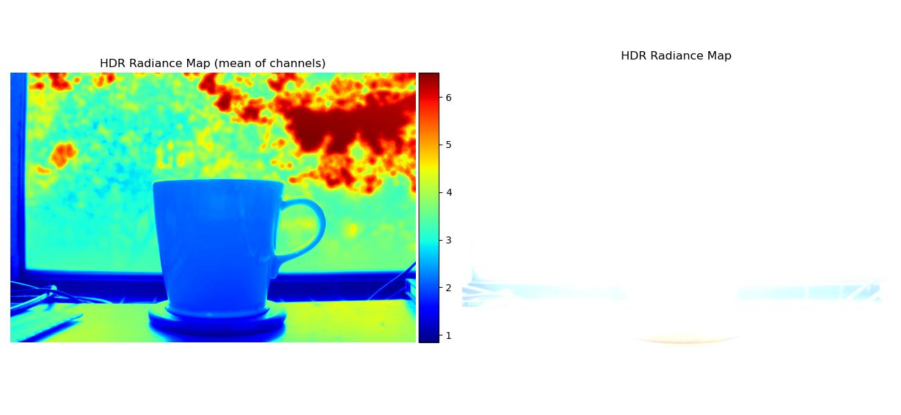
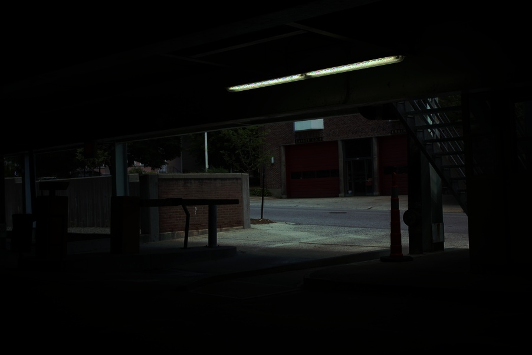
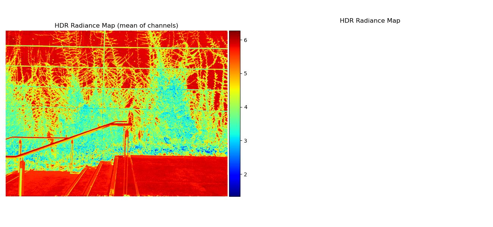

<!-- Mathjax Support -->
<script type="text/javascript" async
  src="https://cdn.mathjax.org/mathjax/latest/MathJax.js?config=TeX-MML-AM_CHTML">
</script>

# High Dynamic Range

[Project Spec](https://cs.brown.edu/courses/cs129/2012/asgn/proj5/)

1. Table of Contents
{:toc}

Modern cameras aren't able to capture the full dynamic range of a scene and typically end up being under- or over-exposed (i.e. there is too little or too much light). To fix this issue, we can combine multiple images taken with different exposure times (aka shutter speed) to create a single [high dynamic range (HDR)](https://en.wikipedia.org/wiki/High_dynamic_range) image. We used this [starter code](https://github.com/BrownCSCI1290/project2-hdr-cs180-fa24).

## Radiance Map Construction

The first part of this project involves constructing a radiance map of the scene using the methodology in sections 2.1 and 2.2 in [Debevec and Malik 1977](http://www.pauldebevec.com/Research/HDR/debevec-siggraph97.pdf).

We define the following variables:

- $$i$$: pixel position in a given image
- $$j$$: index of the image in a given set of images
- $$Z_{ij}$$: observed pixel value at position $$i$$ in image $$j$$
- $$E_i$$: unknown scene *radiance* at pixel $$i$$

The *exposure* at pixel $$i$$ is $$E_i \Delta t_j$$, where $$\Delta t_j$$ is the exposure time/shutter speed.

$$Z_{ij}$$ is a function of the exposure: $$Z_{ij} = f(E_i \Delta t_j)$$. We call $$f$$ the pixel response curve. Instead of solving for $$f$$ directly, we solve for a different function $$g = \ln(f^{-1})$$.

Thus, $$g(Z_{ij}) = \ln(E_i) + \ln(\Delta t_j)$$. It maps We make the assumption that $$E_i$$ is constant across all the images in the set, since the images are static. This allows us to solve for $$g$$ using the code provided at the end of the paper. Once we have $$g$$, we can easily solve for $$E_i$$ by doing: $$E_i = e^{g(Z_{ij}) - \ln(\Delta t_j)}$$ to recover the radiance map.

Some things we had to be careful about when translating the Matlab code to Python:

- Matlab arrays are 1-indexed
- Matlab for loop ranges are inclusive of the start and the end
- `A \ b` means "A matrix left divide b" which can be accomplished in numpy [like so](https://stackoverflow.com/questions/7160162/left-matrix-division-and-numpy-solve)

To make the results robust, the algorithm in the paper solves for $$g$$ by adding constraints to make it smooth and weights the contribution of each pixel according to equation 6 in the paper and a weighting function $$w$$ which is a triangle function (i.e. it increases linearly until a peak, and then decreases linearly).

Below are the results for the given image sets.

| Image Set | Recovered $$g$$ plots |
| :--- | :--- |
| arch |  |
| bonsai |  |
| chapel |  |
| garage |  |
| garden |  |
| house |  |
| mug |  |
| window |  |

Note that some regular radiance maps were so bright they're mostly white, but you can see the values more clearly through the mean of channels radiance map.

| Image Set | Radiance Maps |
| :--- | :--- |
| arch |  |
| bonsai |  |
| chapel |  |
| garage |  |
| garden |  |
| house |  |
| mug |  |
| window |  |

## Tone Mapping

Next we can convert the radiance map to an HDR image using various tone mapping methods:

1. **Global Scale**: This is just [min-max normalization](https://en.wikipedia.org/wiki/Feature_scaling#Rescaling_(min-max_normalization)).
2. **Global Simple**: Puts the radiance map values through a function and then performs the Global Scale operation. We tried various functions like $$\log(x)$$, $$\sqrt{x}$$, and $$x / (1 + x)$$, and found the last one looked best.
3. **Durand**: Implements the methods described in [Durand and Dorsey 2002](https://people.csail.mit.edu/fredo/PUBLI/Siggraph2002/DurandBilateral.pdf) - see the project spec for the pseudocode. We played around with different parameter values and settled on:
    1. `d = 15` for `cv2.bilateralFilter`
    2. `sigmaColor = 75` for `cv2.bilateralFilter`
    3. `sigmaSpace = 75` for `cv2.bilateralFilter`
    4. `dR = 5`
    5. `gamma = 0.6` for gamma compression

Here are our results:

| Global Scale | Global Simple | Durand |
| :--- | :--- | :--- |
|  |  |  |
|  |  |  |
|  |  |  |
|  |  |  |
|  |  |  |
|  |  |  |
|  |  |  |

## Bells & Whistles

### Geometric Alignment

As you can see from the images above, the garden and house images are blurry due to the images in the set being slightly misaligned (which can happen if taking the pictures by hand, for example). To fix this, we modified our multi-scale alignment code from [Project 1](https://phrdang.github.io/cs180-portfolio/proj1/#multi-scale-alignment-image-pyramid) to geometrically align the garden and house image sets. This was our overall approach for each set:

```
color_images = read in all images in the set as color images
grayscale_images = read in all images in the set as grayscale images

displacements = []
for gray_im in grayscale_images[1:]:
    dx_i, dy_i = compute multi-scale alignment displacement to align gray_im to grayscale_images[0]
        using structural similarity metric
    displacements.append((dx_y, dy_i))

aligned = []
for color_im in color_images[1:]:
    dx_i, dy_i = get displacement for current color_im
    aligned_i = translate(color_im, dx_i, dy_i)
    aligned.append(aligned_i)

return aligned
```

Here are the $$g$$ plots:

| Image Set | Recovered $$g$$ plots |
| :--- | :--- |
| garden |  |
| house |  |

Here are the radiance maps:

| Image Set | Radiance Maps |
| :--- | :--- |
| garden |  |
| house |  |

Here are the tone mapping results, which are less blurry:

| Global Scale | Global Simple | Durand |
| :--- | :--- | :--- |
|  |  |  |
|  |  |  |

### Taking Our Own Photos

We also wanted to try taking our own photos of campus. Because we didn't have professional cameras, we used our phones and had to download a special camera app called [Yamera](https://apps.apple.com/us/app/yamera-manual-camera/id951399974) that let us take longer exposures. (The regular Camera app on an iPhone only lets you take short exposures that are on the order of a thousandth of a second.)

We also had to perform geometric alignment to ensure the images were clear, since we took the images by hand.

Here are the $$g$$ plots:

| Image Set | Recovered $$g$$ plots |
| :--- | :--- |
| cory |  |
| trees |  |
| vines |  |

Here are the radiance maps:

| Image Set | Radiance Maps |
| :--- | :--- |
| cory |  |
| trees |  |
| vines |  |

Here are the tone mapping results:

| Global Scale | Global Simple | Durand |
| :--- | :--- | :--- |
|  |  |  |
|  |  |  |
|  |  |  |
