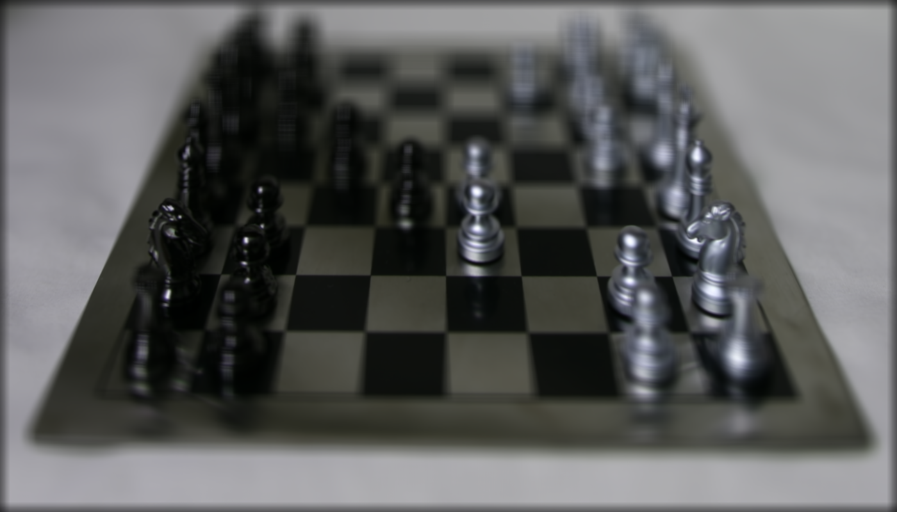
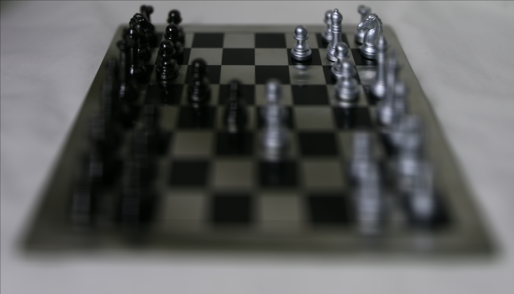
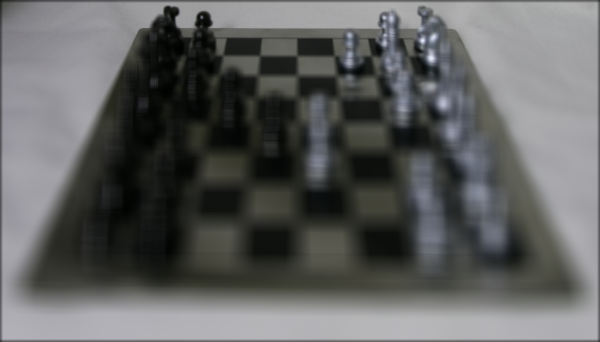
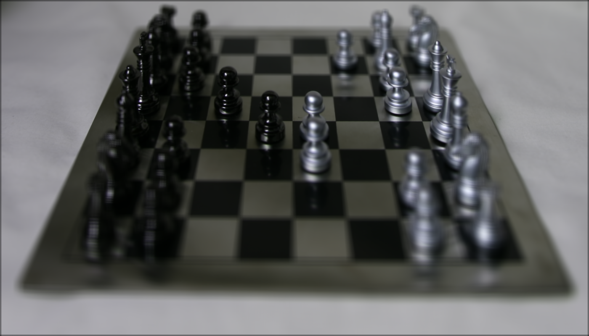
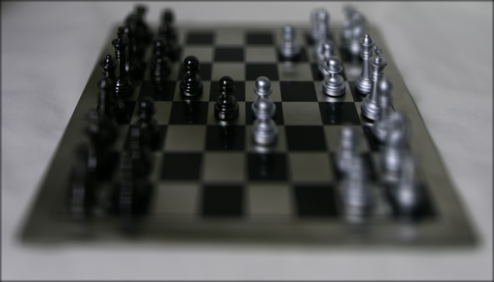

<!-- Mathjax Support -->

# Light Field Camera

[Project Spec](https://inst.eecs.berkeley.edu/~cs194-26/fa17/hw/proj5/)

1. Table of Contents
{:toc}

In this project, we implemented depth refocusing and aperture adjustment using methods described in section 4 of [Ng et al. 2005](https://graphics.stanford.edu/papers/lfcamera/lfcamera-150dpi.pdf). We used the chess image dataset from the [Stanford Light Field Archive](http://lightfield.stanford.edu/lfs.html). The images are all of the same chess set, taken at slightly different world coordinates on a $$17 \times 17$$ grid.

## Depth Refocusing

To implement depth refocusing, we can utilize the fact that objects far away from the camera don't change their position a lot when the camera moves around if the [optical axis](https://en.wikipedia.org/wiki/Optical_axis) stays the same. However, nearby objects change position a lot across images. Thus we can shift the images and then average all the shifted images to allow you to focus on the image at different depths. Specifically, this was our approach:

1. Read in all images from the dataset, making sure to associate each image with its relative $$(x, y)$$ position on the $$17 \times 17$$ grid. To compute the relative position on the grid, we have to subtract $$17 // 2 = 8$$ from the $$x$$ and from the $$y$$ coordinate given in the file names. Note that we choose the center, $$(0, 0)$$, as our reference point.
2. For each image:
    1. Get the relative $$(x, y)$$ position of the image
    2. Compute the shift amounts:
        1. Shift the image in the $$x$$ direction by $$\text{depth} * x$$
        2. Shift the image in the $$y$$ direction by $$-1 * \text{depth} * y$$
        3. Note that we used [`scipy.image.shift`](https://docs.scipy.org/doc/scipy/reference/generated/scipy.ndimage.shift.html) with `order=0` to speed up the computation (otherwise it took ~10 minutes per image).
    3. Shift the image by those amounts
3. Take the average of all shifted images
4. Normalize the mean of the images (e.g. divide everything by the maximum value)

We did this algorithm for depths -1.8 to 0.8 (inclusive), with a step size of 0.2 (these values were determined manually to provide a range of focused areas in the image). You can see that as the depth increases, the focus of the image shifts from the bottom to the top of the image.

| Depth = -1.8 | Depth = 0.0 | Depth = 0.8 |
| :--- | :--- | :--- |
|  |  |  |

Here is a gif of the results across all depths:

## Aperture  Adjustment

We can use a very similar approach to simulate different camera [aperture](https://en.wikipedia.org/wiki/Aperture) values. The algorithm is the same as before, except we have a fixed `depth = -0.8` (chosen manually such that the center of the image is in focus) and we only include shifted images where the relative $$(x, y)$$ positions are less than or equal to the aperture. Intuitively, this means that for larger apertures, we sample more images, including more light and thus making the image blurrier.

We did this algorithm for apertures 0 to 10 (inclusive), with a step size of 1. You can see that as the aperture increases, the image gets blurrier.

| Aperture =  0 | Aperture = 5 | Aperture = 10 |
| :--- | :--- | :--- |
|  |  |  |

Here is a gif of the results across all apertures:

## Summary

It's really cool how you can simulate different camera parameters such as depth and aperture just by taking a set of images of the same scene. In this project, we learned that you can think of depth essentially as shifting images using a certain scale factor, and how you can think of aperture essentially as sampling more or less versions of the image to simulate taking in more or less light.
